# MediLink Mobile App

This is the official Flutter mobile application for **MediLink**, designed specifically for doctors. It allows doctors to securely log in, create prescriptions, and manage patient medication histories within a secure digital health ecosystem.

## 📱 Features

- 🔐 Secure login with fingerprint or email/password.
- ➕ Add new prescriptions with patient info and medicine details.
- 🧾 View, edit, or delete previous prescriptions.
- 📦 Sync prescriptions to the central Firestore database.
- 👨‍⚕️ Each doctor only sees prescriptions they've created.
- 🌐 Built with Flutter and Firebase.

## 📂 Folder Structure

```
mobile_app/
├── android/              # Android platform-specific code
├── ios/                  # iOS platform-specific code
├── lib/                  # Main Flutter code (UI, logic)
├── assets/               # Fonts, images, etc.
├── ids/                  # Captured doctor syndicate ID images
├── test/                 # Unit and widget tests
├── pubspec.yaml          # Dependencies
└── README.md             # This file
```

## 🚀 Getting Started

### Prerequisites

- Flutter SDK installed
- Firebase project setup
- Android Studio / VS Code

### Installation

1. Clone the full MediLink repo and navigate to the mobile directory:

```bash
git clone https://github.com/markamgad1/MediLink-Graduation-Project.git
cd MediLink-Graduation-Project/mobile_app
```

2. Install dependencies:

```bash
flutter pub get
```

3. Run the app:

```bash
flutter run
```


## 📱 Screenshots

Here are some screenshots from our MediLink doctor mobile app:

<h3>🏠 First Screen</h3>
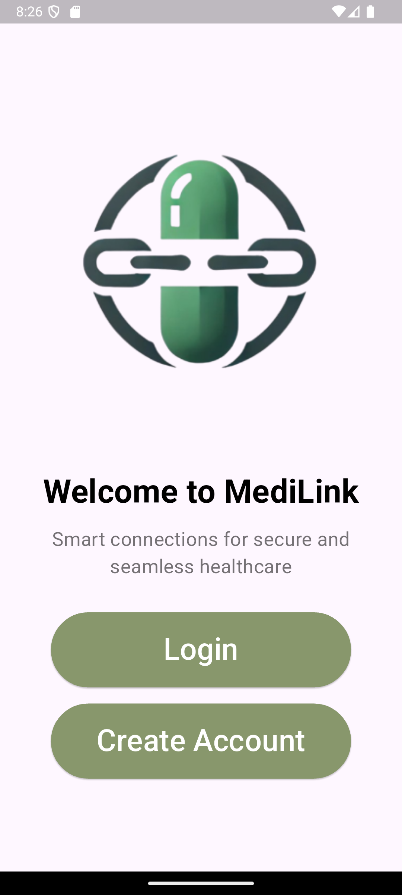

<h3>🔐 Login Screen</h3>
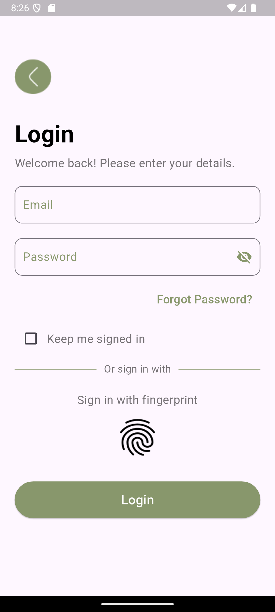

<h3>❓ Forgot Password</h3>
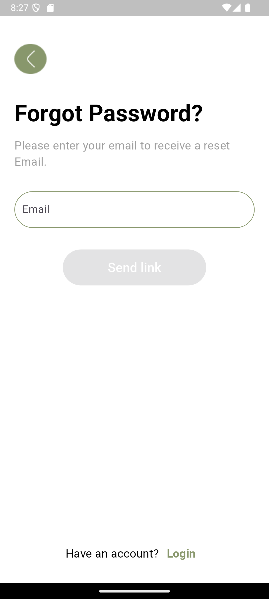

<h3>❗ Create Account</h3>
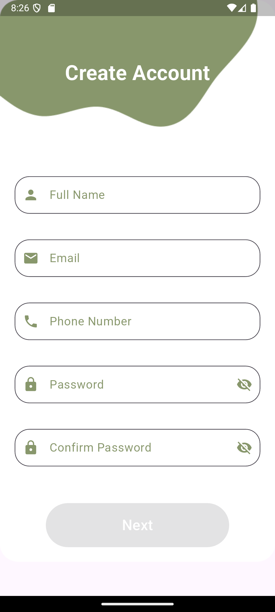
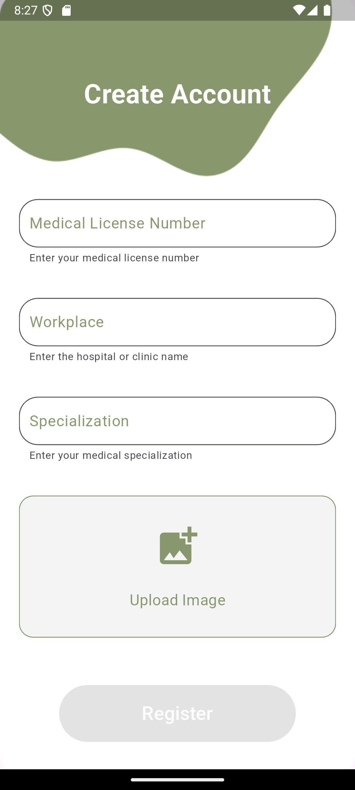

<h3>🏠 Home Screen</h3>
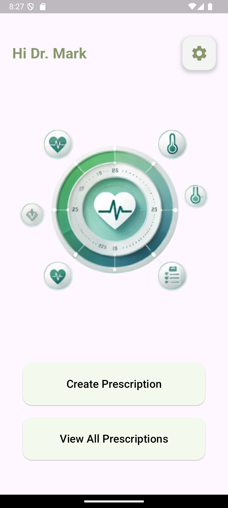

<h3>⚙️ Settings</h3>
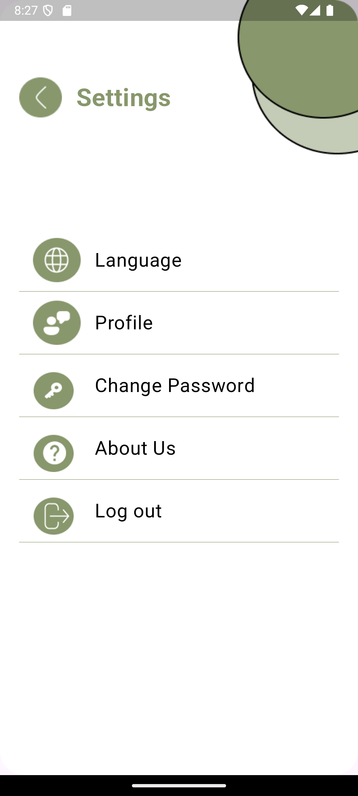

<h3>🌐 Language Selection</h3>
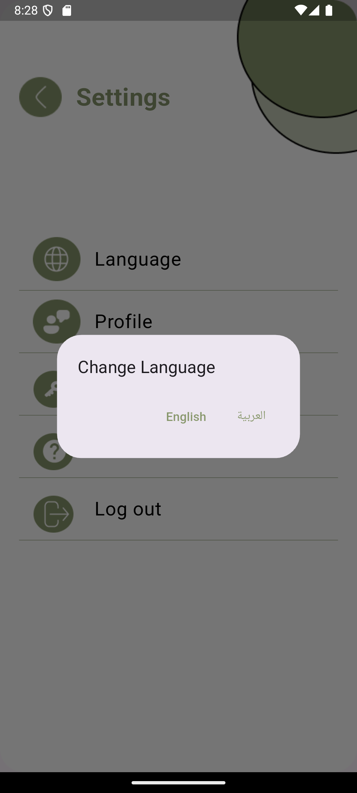

<h3>👤 Profile</h3>
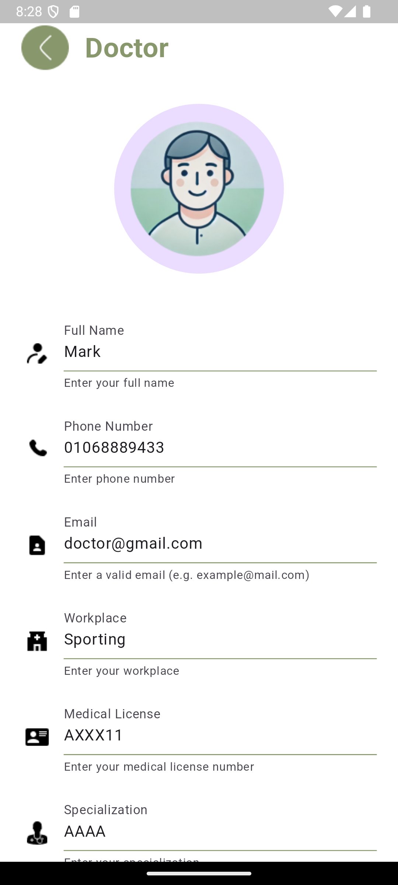

<h3>🔒 Change Password</h3>
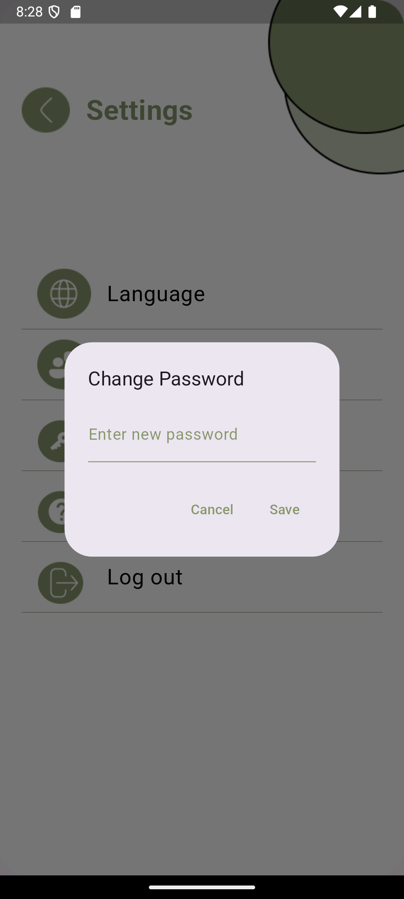

<h3>ℹ️ About Us</h3>
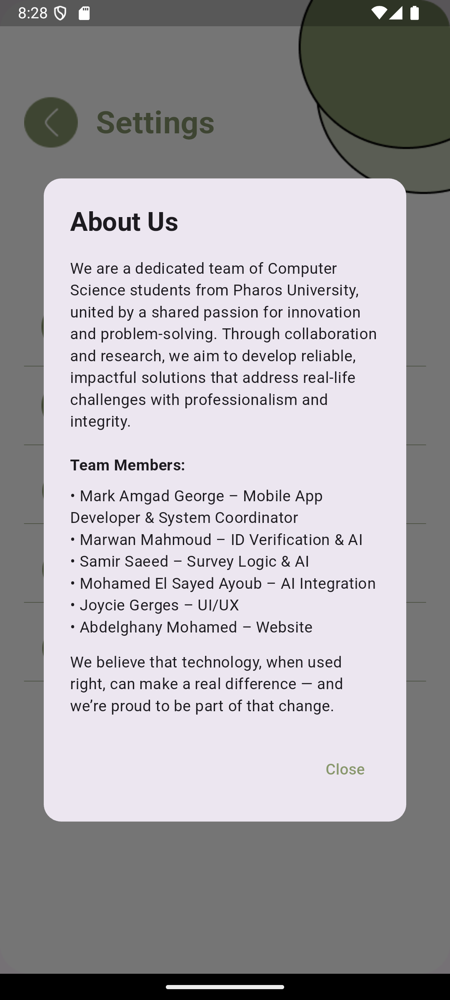

<h3>📝 Add Prescription</h3>
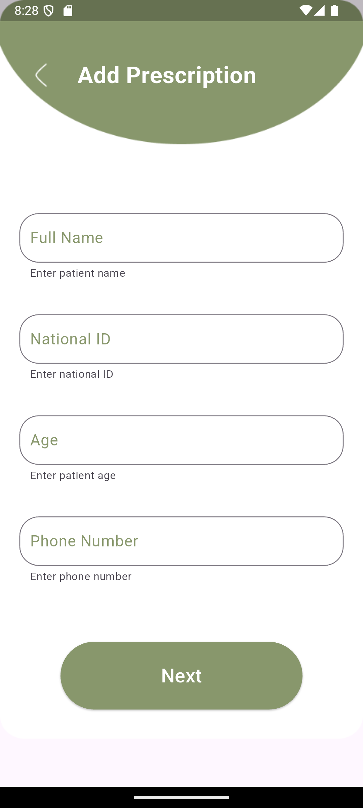

<h3>➕ Add Medicine</h3>
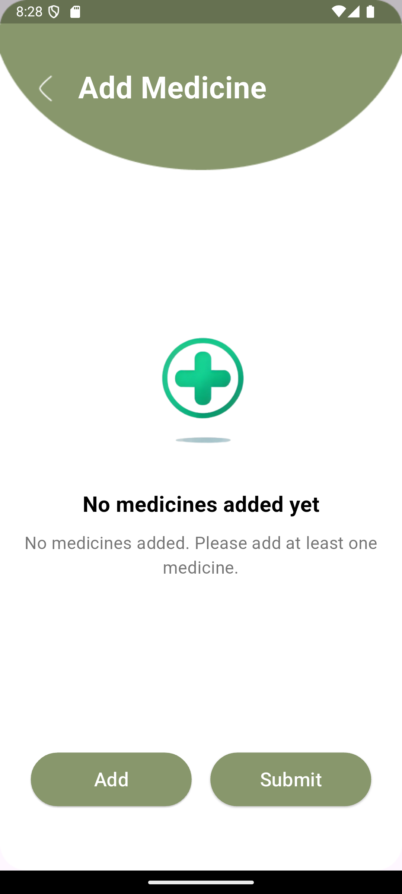

<h3>📃 Medicines List</h3>
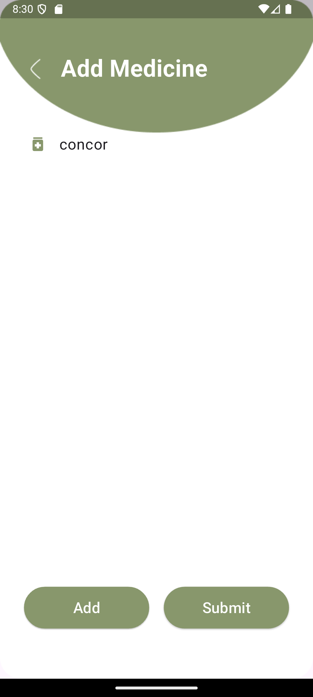

<h3>📋 All Prescriptions</h3>
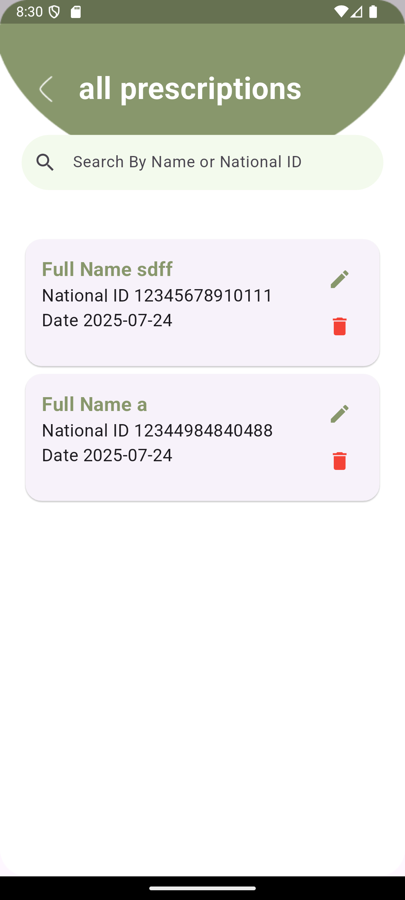

<h3>✏️ Edit Prescription</h3>
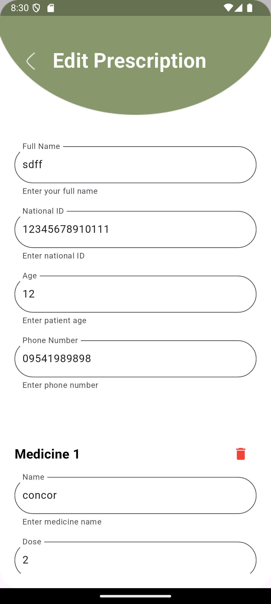


## 🔐 Security Notes

- Do NOT upload `google-services.json` or any secrets in this repo.
- All sensitive keys are added to `.gitignore`.
- Always rotate API keys if accidentally committed.

## 📜 License

This project is licensed under the MIT License. See the main LICENSE file in the root project directory.

